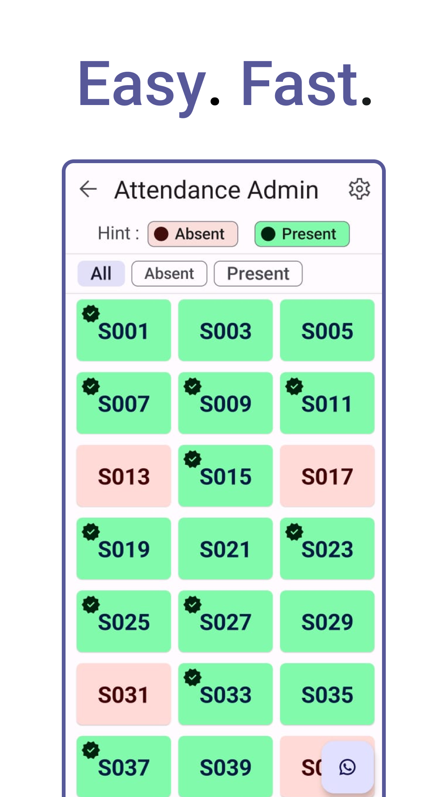
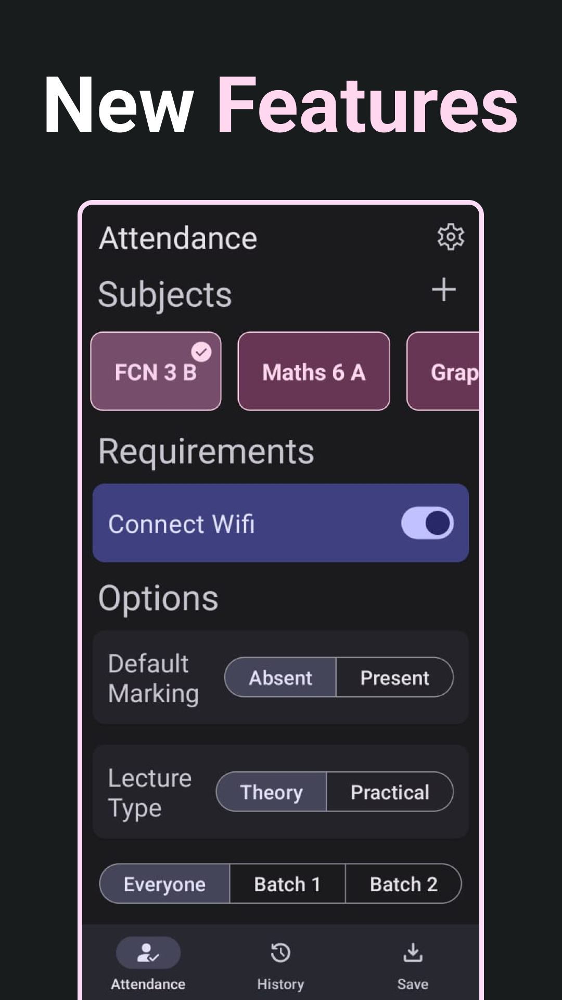
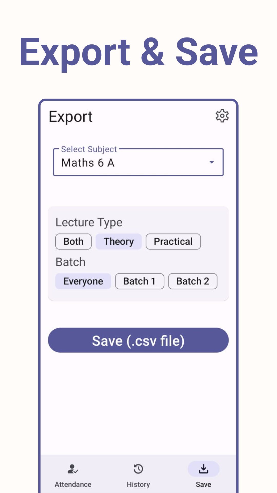
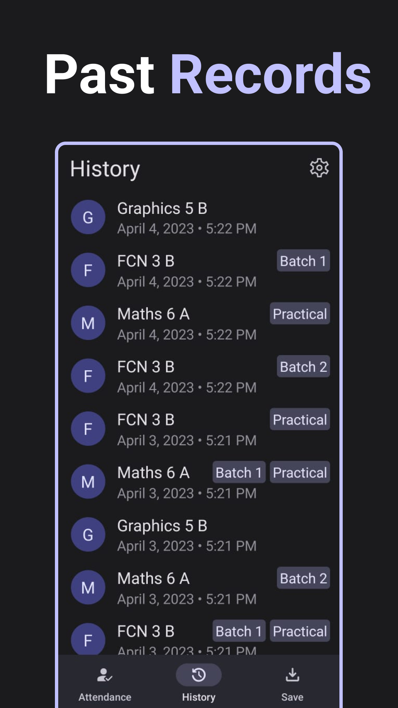

# Atten Admin - Teacher's attendance app
The Atten Admin App is a mobile application that enables teachers to take attendance of students quickly and efficiently. The app uses Bluetooth and internet connectivity to automatically detect students' location and mark their attendance accordingly. The app also stores the history of the attendance records, and teachers can export the attendance records as a CSV file. Additionally, the app includes a feature for students to mark their attendance easily via Bluetooth and internet connection within seconds.

## Download
Atten Admin app is available on the [Google Play Store](https://play.google.com/store/apps/details?id=com.meet.attenadmin). 

## Features
* Quick and easy attendance taking using Bluetooth and internet connectivity.
* User-friendly interface for easy navigation.
* Reliable attendance tracking system for accuracy and efficiency.
* Attendance history records stored for easy access and review.
* Export attendance records as a CSV file for record-keeping purposes.
* Option for students to mark their attendance easily via Bluetooth and internet connectivity.
* Option for students to view their attendance percentage.

### Usage
1. Open the Attendance App on your mobile device.
2. Select the subject / class for attendance.
3. Click on the "Take Attendance" button to take attendance for a class.

<!-- ### Screenshots
 
  -->

### Future Enhancements
* Bug fixes and improvements.

### Contributing
We welcome contributions to the App. If you have any suggestions or ideas for improvements, feel free to request or contact us.
